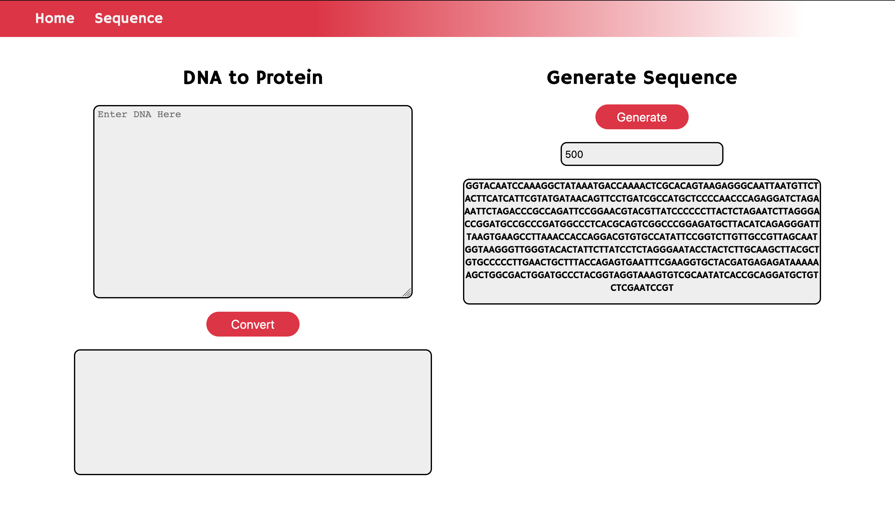
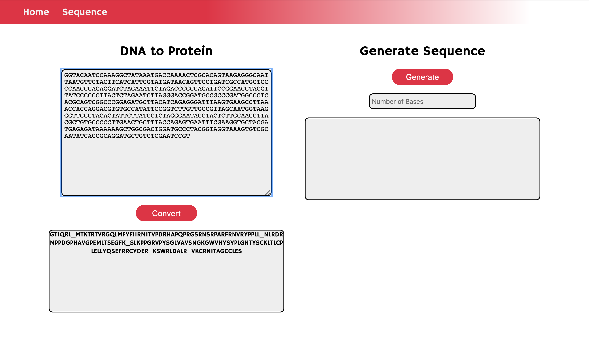

<h1 align="center">Sequencinator</h1>

### Description
This project was made as an extension to a Uni project to generate DNA strands and convert them in Python. I've added a frontend made with Flask, HTML&CSS as a way to practice more with the Flask framework. I might come tinker with this project at a later time, however, for now it is done.

### Display
 

#### Script Checklist
- [x] Generate Random Nucleotide Sequences
- [x] Read in Existing Sequences from text files
- [x] Generate Protein Sequence with STOP and Met indicators
- [ ] Easy Read
	- [x] Object Naming
	- [x] Nucleotide Output
	- [x] Protein Output
	- [ ] Frame Slicing

#### Note:
This was developed in python so don't expect the project to scale to large sequences very well. Also I have a very basic understanding of biology, so if I've used the wrong terminology… oops?
